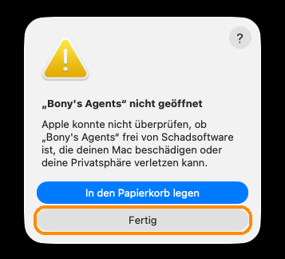
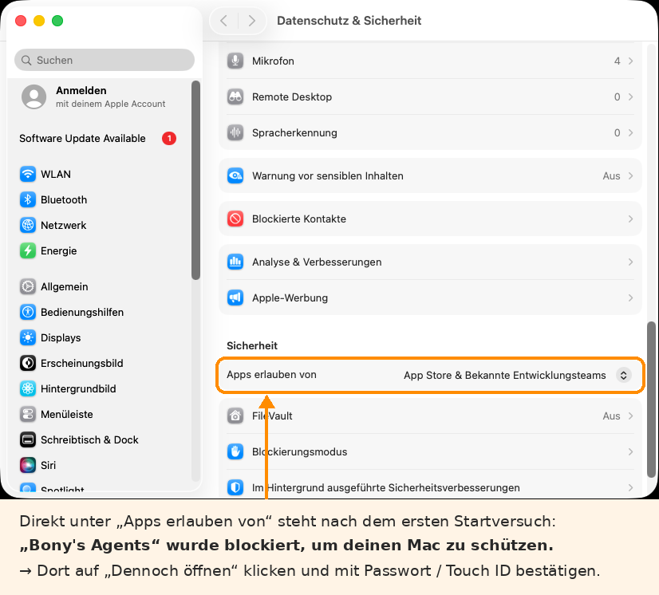

# Bony's Agents


▶ **Videos und Anleitungen:** [youtube.com/@BonysAgents](https://www.youtube.com/@BonysAgents)

**Virtuelle Agent-PCs per Mausklick – mit Brave, Telegram und Hermes Agent.**
Läuft auf Linux, macOS und Windows. Freie Software unter GPL-3.0-or-later.

Bony's Agents erstellt einen eigenen, vom Hauptsystem getrennten Rechner (eine virtuelle
Maschine) mit **Debian 13 „Trixie“** und einem Desktop nach Wahl (Cinnamon, Xfce, KDE Plasma, GNOME, MATE
oder LXQt). Darin sind fertig eingerichtet:

- **Brave Browser** – aus dem offiziellen Brave-Repository
- **Telegram Desktop** – über Flathub
- **KI-Werkzeuge nach Wahl**, frei kombinierbar – jeweils mit dem offiziellen Installer:
  - **Hermes Agent** – der selbstlernende KI-Agent von Nous Research (Standard)
  - **OpenClaw** – persönlicher KI-Assistent mit Chat-Anbindung (Telegram, WhatsApp u. a.)
  - **Claude Code** – KI-Programmierhilfe von Anthropic im Terminal

Der KI-Agent arbeitet so in seiner eigenen Umgebung: Er kann Programme installieren,
im Browser surfen und Dateien anlegen, ohne an dein eigentliches System zu kommen.

## Funktionen

- Desktop-App mit Übersicht, Start/Stopp, Live-Konsole und Einrichtungs-Fortschritt
- Vollständige Kommandozeile für Skripte und Server (`bonys-agents …`)
- Ressourcen automatisch passend zum Host: alle CPU-Kerne, so viel RAM wie sicher möglich,
  Festplatte von 32 GB bis 1 TB, Standard 64 GB (dynamisch – belegt nur, was wirklich genutzt wird),
  später jederzeit vergrößerbar
- Hardware-Beschleunigung automatisch: KVM (Linux), HVF (macOS), WHPX (Windows),
  mit Software-Rückfallebene
- Läuft auf x86_64 und ARM64 (Apple Silicon)
- Image wird per SHA512 geprüft, Passwort-Daten werden nach der Einrichtung gelöscht
- Speicherort frei wählbar – z. B. eine externe SSD; Agent-PCs werden auf jedem Laufwerk automatisch wiedergefunden
- Fertige Installer: `.deb` für die Paketverwaltung und Setup.exe für Windows
- Fernzugriff per RDP (xrdp, mit Ton) und SPICE (echter Bildschirm, Ton, Zwischenablage) – standardmäßig aus, per Knopf sofort an (bis zum Herunterfahren oder dauerhaft), mit Remmina-Profilen
- Eigenes Hintergrundbild im Agent-PC (Desktop und Anmeldebildschirm, unverzerrt), Git und Build-Werkzeuge vorinstalliert
- Die Auflösung folgt dem QEMU-Fenster wie bei VirtualBox mit Gasterweiterungen – vergrößern, verkleinern, maximieren, Vollbild (Start in 800×600); „Herunterfahren“ wirkt sofort, ohne Rückfrage im Agent-PC
- Updates per Knopfdruck – für die App selbst (signiert und geprüft) und für die Agent-PCs (siehe „Updates“)
- Unterbrochene Einrichtung (QEMU beendet, Neustart, Speichermangel) läuft beim nächsten Start dort weiter, wo sie war
- Selbsttest `bonys-agents selftest`: prüft, ob QEMU auf diesem Rechner startet
- Vorlagen: einen fertig eingerichteten Agent-PC als Vorlage speichern – neue Agent-PCs entstehen daraus in Sekunden, ohne Downloads und Einrichtung (siehe „Vorlagen“)
- Weitere Programme lassen sich als kleines Modul ergänzen (siehe `src/bonys_agents/apps.py`)

## Installation – ganz ohne Terminal

Lade auf der **Releases-Seite** die Datei für dein System herunter:

| System | Datei | So geht's |
|---|---|---|
| **Windows 10/11** | `BonysAgents-Setup-0.13.0.exe` | Doppelklick → „Weiter“ → „Installieren“. Der Installer richtet QEMU und die Hardware-Beschleunigung gleich mit ein. Danach ggf. einmal neu starten. |
| **Debian, Ubuntu, Linux Mint** | `bonys-agents_0.13.0_amd64.deb` (ARM: `_arm64.deb`) | Doppelklick → die Softwareverwaltung öffnet sich → „Installieren“. QEMU wird automatisch mitinstalliert. |
| **Mac mit Apple-Chip** (M1, M2, M3 …) | `BonysAgents-0.13.0-macos-applesilicon.dmg` | Öffnen, „Bony's Agents“ auf „Programme“ ziehen. Beim ersten Start: siehe [macOS](#macos). |
| **Mac mit Intel-Prozessor** | `BonysAgents-0.13.0-macos-intel.dmg` | wie oben |

Danach findest du **„Bony's Agents“** im Startmenü bzw. Anwendungsmenü.
Deinstallieren geht wie bei jedem anderen Programm – deine Agent-PCs bleiben dabei erhalten.

<details>
<summary>Für Fortgeschrittene: Installation aus dem Quellcode</summary>

**Linux:** `./install.sh` (fragt einmal nach dem Passwort)
**Windows:** `install.cmd` doppelklicken
**Entwicklung:** `pip install -e ".[dev]"`

</details>

### Pakete selbst bauen

| Paket | Befehl |
|---|---|
| `.deb` | `packaging/linux/build-deb.sh` → `dist/bonys-agents_<version>_<arch>.deb` |
| Windows-Setup | `packaging\windows\build-setup.cmd` doppelklicken (auf einem Windows-PC) → `dist\BonysAgents-Setup-<version>.exe` |
| macOS-App | `pip install . pyinstaller && pyinstaller packaging/bonys-agents.spec`, dann `packaging/macos/sign.sh` und `packaging/macos/build-dmg.sh` (auf einem Mac) |
| Alles auf einmal | Auf GitHub ein Tag `v0.13.0` anlegen – die Aktion *Release* baut `.deb` (amd64 + arm64), Setup.exe und die macOS-Apps (Apple-Chip + Intel), testet sie, signiert alles und veröffentlicht es (Anleitung: [docs/RELEASE.md](docs/RELEASE.md)) |

### Was die App selbst erledigt

Fehlt später etwas (z. B. nach einem System-Update), meldet sich beim Start der
Assistent **„Rechner vorbereiten“** und richtet es per Knopfdruck wieder ein.
In der Kommandozeile geht das mit `bonys-agents setup`.

| | Linux | Windows | macOS |
|---|---|---|---|
| QEMU | Paketmanager (apt, dnf, pacman, zypper) | winget | Homebrew |
| Beschleunigung | KVM-Zugriff für deinen Benutzer | Windows-Hypervisorplattform | eingebaut (HVF) |
| Rechte | einmal Passwort (sudo/pkexec) | einmal Windows-Zustimmung | nur wenn Homebrew fehlt: dessen Installer fragt im Terminal |

Nur wenn die Virtualisierung im **BIOS/UEFI** ausgeschaltet ist (Intel VT-x bzw.
AMD-V/SVM), musst du selbst ran – das kann kein Programm von innen ändern.

## macOS

**Voraussetzung: macOS 14 (Sonoma) oder neuer** – auf einem Mac mit Apple-Chip oder Intel-Prozessor.
Ältere Versionen gehen nicht: Qt (die Bibliothek für die Fenster der App) braucht seit Version 6.12
macOS 14, und Homebrew unterstützt ältere Versionen nicht mehr.
Welcher Chip steckt drin? Apple-Menü  → „Über diesen Mac“: Steht dort „Chip Apple M…“, ist es die
`applesilicon`-Datei, steht dort „Prozessor Intel …“, die `intel`-Datei.

### Erster Start

Bony's Agents ist nicht von Apple notarisiert (das kostet ein bezahltes Apple-Entwicklerkonto). Darum
fragt macOS beim **allerersten** Start einmal nach – danach startet die App ganz normal.

**macOS 15 (Sequoia) und neuer**

1. Die `.dmg` öffnen und „Bony's Agents“ auf **„Programme“** ziehen. Dann Bony's Agents im Ordner
   „Programme“ doppelklicken. macOS meldet *„Bony's Agents“ nicht geöffnet* → **„Fertig“** klicken
   (nicht „In den Papierkorb legen“).

   

2. Apple-Menü  → **Systemeinstellungen** → **Datenschutz & Sicherheit**, ganz nach unten zu
   **„Sicherheit“** scrollen. Dort steht *„Bony's Agents“ wurde blockiert …* → **„Dennoch öffnen“**
   klicken und mit dem Mac-Passwort bzw. Touch ID bestätigen.

   

3. Bony's Agents noch einmal öffnen und im Dialog **„Dennoch öffnen“** wählen.

**macOS 14 (Sonoma):** Im Ordner „Programme“ mit der **rechten Maustaste** (oder ctrl-Klick) auf
Bony's Agents → **„Öffnen“** → im Dialog noch einmal **„Öffnen“**.

**Klappt das nicht** (etwa die Meldung *„ist beschädigt und kann nicht geöffnet werden“*): Programm
**Terminal** öffnen (Programme → Dienstprogramme) und eingeben:

```bash
xattr -cr "/Applications/Bony's Agents.app"
```

Das entfernt nur die „aus dem Internet geladen“-Markierung; danach startet die App normal.
Die `.dmg` enthält dieselbe Anleitung als Textdatei „Zuerst lesen – erster Start“.

### QEMU auf dem Mac

Beim ersten Start meldet sich **„Rechner vorbereiten“**. „Automatisch einrichten“ installiert QEMU über
[Homebrew](https://brew.sh), den bekanntesten Paketmanager für macOS. Fehlt Homebrew, erklärt die App
das und öffnet auf Wunsch ein Terminal-Fenster mit dem **offiziellen Installer** von brew.sh – dort
bestätigst du selbst mit der Eingabetaste und deinem Mac-Passwort; danach wird QEMU gleich mitinstalliert.
Auf Macs mit Apple-Chip dauert das wenige Minuten. **Intel-Macs:** Homebrew bietet für Intel inzwischen
oft keine fertigen Pakete mehr an – dann baut der Mac QEMU selbst, das kann 30–60 Minuten dauern.

- Homebrew liegt auf Macs mit Apple-Chip unter `/opt/homebrew`, auf Intel-Macs unter `/usr/local`.
  Die App sucht QEMU dort selbst (aus dem Finder gestartete Apps kennen diese Ordner sonst nicht).
- Macs mit Apple-Chip bekommen das **ARM64**-Debian-Image (Maschine `virt` mit der UEFI-Firmware
  `edk2-aarch64-code.fd` aus Homebrew-QEMU), Intel-Macs das **amd64**-Image.
- Hardware-Beschleunigung über **HVF** (Hypervisor.framework) ist bei jedem halbwegs aktuellen Mac
  eingebaut. Läuft macOS selbst in einer virtuellen Maschine, fehlt HVF – dann ist alles sehr langsam.
- `bonys-agents doctor` zeigt auf dem Mac Chip, Homebrew, QEMU-Pfad und HVF an. Die Kommandozeile
  liegt in der App: `"/Applications/Bony's Agents.app/Contents/MacOS/bonys-agents" doctor`.
- Hast du versehentlich die Intel-Version auf einem Mac mit Apple-Chip installiert, läuft sie über
  Rosetta; die App weist darauf hin, und das nächste Update holt automatisch die richtige Version.

## Benutzung

### Desktop-App

`bonys-agents` (oder `bonys-agents gui`) starten → **„+ Neuer Agent-PC“** →
Name, Passwort, Ressourcen und Programme wählen → **Erstellen und starten**.

Der Agent-PC ist ein Debian 13 mit dem gewählten Desktop (Standard: Cinnamon), deutscher Sprache und Tastatur.
Brave, Telegram und Hermes Agent liegen als Symbole auf dem Schreibtisch.

Beim ersten Mal wird das offizielle Debian-13-Cloud-Image (ca. 450 MB) geladen. Danach richtet sich der
Agent-PC unsichtbar im Hintergrund selbst ein; den Fortschritt siehst du live in der App.
Je nach Rechner und Internet dauert das 15–60 Minuten. Danach schaltet er sich kurz aus und
öffnet sich automatisch im Fenster (anfangs 800×600) mit fertigem Desktop – war die App da gerade zu,
passiert das beim nächsten Öffnen der App. Wird die Einrichtung unterbrochen (QEMU beendet,
Rechner neu gestartet, zu wenig Arbeitsspeicher), zeigt die App „Einrichtung abgebrochen“ samt
vermuteter Ursache – ein Klick auf „Einrichtung fortsetzen“ macht beim unterbrochenen Schritt weiter;
erledigte Schritte werden übersprungen.

Während der unsichtbaren Einrichtung zeigt **„Trotzdem anzeigen“** die Konsole groß und bietet
**„Terminal im Agent-PC öffnen“** (SSH mit Benutzer und Passwort des Agent-PCs) sowie
**„Einrichtungsprotokoll holen“** (kopiert `/var/log/bonys-agents.log` und
`/var/log/cloud-init-output.log` in den Ordner des Agent-PCs). **„Protokolle öffnen“** öffnet diesen
Ordner – dort liegen auch die Konsolenausgaben früherer Starts (`console-<Datum>.log`).

> **Ohne Hardware-Beschleunigung** (Beschleuniger „tcg“) kann die Einrichtung mehrere Stunden dauern.
> Läuft Bony's Agents selbst in einer virtuellen Maschine, dort die *verschachtelte Virtualisierung*
> (nested virtualization) einschalten.

### Kommandozeile

```bash
bonys-agents setup                         # QEMU & Beschleunigung automatisch einrichten
bonys-agents selftest                      # prüfen, ob QEMU auf diesem Rechner startet
bonys-agents create mein-agent             # anlegen und starten (fragt nach Passwort)
bonys-agents create mein-agent --wait      # … und warten, bis alles eingerichtet ist
bonys-agents create mein-agent --agents hermes,claude-code   # KI-Werkzeuge wählen (oder: none)
bonys-agents apps                          # alle Programme und KI-Werkzeuge
bonys-agents install mein-agent openclaw   # nachträglich installieren (Agent-PC läuft)
bonys-agents connect mein-agent --rdp      # Verbindung öffnen (oder --spice)
bonys-agents remote mein-agent on          # Fernzugriff sofort an, bis zum Herunterfahren (off = aus)
bonys-agents remote mein-agent on --permanent   # … dauerhaft, auch nach Neustarts
bonys-agents display mein-agent spice      # SPICE-Fenster statt QEMU-Fenster
bonys-agents screen mein-agent             # Bildschirm-Einstellung anzeigen
bonys-agents screen mein-agent fixed --size 1600x900   # feste Auflösung (scale = Bild skalieren, auto = Standard)
bonys-agents fullscreen mein-agent         # QEMU-Fenster als Vollbild (zurück mit Strg+Alt+F)
bonys-agents display-driver mein-agent     # Anzeige-Treiber in älteren Agent-PCs nachrüsten
bonys-agents list                          # alle Agent-PCs
bonys-agents status mein-agent             # Details, Fortschritt, SSH-Befehl
bonys-agents logs mein-agent               # Konsolenausgabe
bonys-agents stop mein-agent               # sauber herunterfahren (nach 90 s notfalls hart aus)
bonys-agents stop mein-agent --force       # sofort ausschalten
bonys-agents start mein-agent              # wieder starten – mit Fenster (--headless = ohne)
bonys-agents start mein-agent --wait       # unterbrochene Einrichtung fortsetzen und abwarten
bonys-agents upgrade mein-agent            # Agent-PC aktualisieren (--all = alle laufenden)
bonys-agents update --check                # gibt es eine neue Version von Bony's Agents?
bonys-agents update                        # … und installieren (fragt vorher)
bonys-agents resize mein-agent 128        # Festplatte auf 128 GB vergrößern (ausgeschaltet)
bonys-agents delete mein-agent             # löschen
```

Wichtige Optionen für `create`:

| Option | Bedeutung | Standard |
|--------|-----------|----------|
| `--cpus N` | CPU-Kerne | alle Kerne des Hosts |
| `--ram MB` | Arbeitsspeicher | Host-RAM minus Reserve |
| `--disk GB` | Festplatte, 32 bis 1024 | 64 |
| `--user NAME` | Benutzer im Agent-PC | `agent` |
| `--apps a,b` | Programme und KI-Werkzeuge (`bonys-agents apps`) | brave,telegram,hermes |
| `--agents a,b` | nur die KI-Werkzeuge: hermes, openclaw, claude-code oder none | hermes |
| `--keyboard` | Tastaturlayout | `de` |
| `--headless` | ohne Fenster (z. B. auf einem Server) | – |

### Hermes einrichten

Im Agent-PC das Symbol **Hermes Agent** auf dem Desktop öffnen und einmalig ausführen:

```bash
hermes setup     # Modell bzw. API-Schlüssel wählen, optional Telegram-Bot verbinden
hermes doctor    # Installation prüfen
```

### OpenClaw einrichten

Symbol **OpenClaw** öffnen. Beim ersten Mal startet die Ersteinrichtung (`openclaw onboard`):
Modell wählen, anmelden bzw. API-Schlüssel eingeben, optional einen Chat verbinden. Danach
startet das Symbol direkt `openclaw`. Der Gateway-Dienst wird dabei bewusst **nicht** als
Dauerdienst eingerichtet und lauscht nur innerhalb des Agent-PCs – nach außen ist nichts offen.

### Claude Code einrichten

Symbol **Claude Code** öffnen – es startet `claude` im Ordner `~/Projekte`.
**Claude Code braucht ein eigenes Claude-Konto** (Abo wie Pro/Max oder ein API-Konto;
der kostenlose Plan reicht nicht). Die Anmeldung erfolgt beim ersten Start im Agent-PC über
den offiziellen Weg im Browser (Brave). Bony's Agents legt **keine** Zugangsdaten an und
verändert Claude Code nicht.

### Programme nachträglich hinzufügen

Bei einem laufenden Agent-PC in der Detailansicht unter „Programme“ auf
**„Programme hinzufügen …“** klicken (oder `bonys-agents install NAME APP`). Die Installation
läuft per SSH; das Passwort des Agent-PCs wird nur dafür verwendet und nicht gespeichert.

### Desktop wählen

Im Dialog **„Neuer Agent-PC“** unter **„Desktop“** (oder `bonys-agents create NAME --desktop xfce`).
Alle Desktops kommen aus Debian 13. Liegt der eingestellte Arbeitsspeicher unter der Empfehlung,
warnt die App.

| Desktop | `--desktop` | RAM ab | Download | Passt gut, wenn … |
|---|---|---|---|---|
| **Cinnamon** (Standard) | `cinnamon` | 3 GB | ≈ 370 MB | du eine klassische Bedienung wie unter Windows magst |
| **Xfce** | `xfce` | 2 GB | ≈ 110 MB | der Rechner wenig Arbeitsspeicher hat – leicht und schnell |
| **KDE Plasma** | `kde` | 4 GB | ≈ 910 MB | du viel einstellen willst und genug Speicher und Platz hast |
| **GNOME** | `gnome` | 4 GB | ≈ 560 MB | du die schlichte GNOME-Bedienung mit Übersicht und Dash magst |
| **MATE** | `mate` | 2 GB | ≈ 280 MB | du es klassisch und sparsam willst (Nachfolger von GNOME 2) |
| **LXQt** | `lxqt` | 1,5 GB | ≈ 280 MB | der Rechner sehr schwach ist |

Download = zusätzliche Pakete des Desktops (gemeinsame Pakete wie Schriften und Gast-Werkzeuge
kommen bei allen dazu). `bonys-agents desktops` zeigt die Liste auch im Terminal.

Für alle Desktops gleich:

- **Anmeldung: LightDM mit automatischer Anmeldung.** Er startet jede X11-Sitzung zuverlässig und
  passt schon den Anmeldebildschirm an die Fenstergröße an. KDE empfiehlt SDDM – wird nicht
  installiert, LightDM startet Plasma (X11) problemlos. **Ausnahme GNOME: GDM** – unter LightDM
  schaltet GNOME 48 die Bildschirmsperre ab („erfordert den GNOME Display-Manager“); GDM läuft
  ohne Wayland und meldet automatisch in `gnome-xorg` an.
- **X11-Sitzungen**, auch bei KDE (`plasmax11`) und GNOME (`gnome-xorg`): Fernzugriff per xrdp,
  spice-vdagent und die Anpassung der Auflösung brauchen X11.
- **Hintergrundbild** skaliert mit dunklem Rand – je Desktop über dessen eigene Einstellung
  (gsettings bei Cinnamon/GNOME/MATE, xfconf bei Xfce, Plasma-Skript bei KDE, pcmanfm-qt bei LXQt).
- **„Herunterfahren“** in der App fährt sofort herunter, ohne Rückfrage im Agent-PC – über den
  QEMU-Gast-Agent (kein Desktop kann das abfangen), notfalls per ACPI-Ausschaltknopf.
- **Verknüpfungen** (Hermes, OpenClaw, Claude Code) öffnen das Terminal des Desktops
  (gnome-terminal, xfce4-terminal, konsole, mate-terminal, qterminal). GNOME zeigt keine
  Schreibtisch-Symbole – dort stehen die Programme im Dash.
- Der **Fernzugriff per RDP** startet denselben Desktop.

**Desktop hinzufügen …** (Detailansicht, bei laufendem Agent-PC; oder
`bonys-agents add-desktop NAME xfce [--keep-default]`) installiert einen weiteren Desktop und meldet
künftig automatisch dort an. Der bisherige bleibt installiert und lässt sich am Anmeldebildschirm
weiter wählen. Vorlagen merken sich den Desktop.

### Bildschirm und Vollbild

Die Auflösung des Agent-PCs folgt der Größe des QEMU-Fensters – einfach am Fensterrand ziehen,
maximieren oder **„Vollbild“** in der App drücken (bzw. Strg+Alt+F im Fenster). Der Vollbildmodus
erscheint auf dem Monitor, auf dem das Fenster gerade liegt. Auch der Anmeldebildschirm zieht mit.

So funktioniert es: QEMU meldet die Fenstergröße über die virtuelle Grafikkarte (virtio-gpu mit EDID)
als bevorzugte Auflösung an den Gast. Im Agent-PC sorgt eine udev-Regel bei jedem Hotplug-Ereignis
dafür, dass Anmeldebildschirm und Cinnamon umschalten (kurz entprellt, damit beim Ziehen nicht ständig
umgeschaltet wird).

Unter **„Bildschirm“** in der Detailansicht (oder `bonys-agents screen`) gibt es als Rückfallebene:

| Einstellung | Was passiert |
|---|---|
| Auflösung folgt dem Fenster (Standard) | wie oben |
| Bild skalieren (Zoom to Fit) | feste Auflösung im Agent-PC, QEMU zieht das Bild aufs Fenster |
| Feste Auflösung | feste Auflösung, das Fenster ist genau so groß |

Die Einstellung gilt ab dem nächsten Start. Agent-PCs aus älteren Versionen bekommen den nötigen
Anzeige-Treiber über **„Agent-PC aktualisieren“** oder **„Anzeige-Treiber aktualisieren“** (danach einmal
neu starten). Im **SPICE-Fenster** (Remmina bzw. remote-viewer) passt der SPICE-Client die Auflösung an.

> Cinnamon zeichnet ohne 3D-Grafik per Software (llvmpipe). Nach einem Größenwechsel kann es dabei
> selten abstürzen (Fehler in Mesa/Muffin). Bony's Agents startet Cinnamon dann automatisch neu – offene
> Fenster bleiben erhalten. Das Hintergrundbild wird nach einem Wechsel erst nach einigen Sekunden
> wieder ganz scharf.

## Vorlagen

Ein fertig eingerichteter Agent-PC lässt sich als **Vorlage** speichern. Neue Agent-PCs entstehen
daraus in Sekunden – ohne erneuten Download und ohne Einrichtung.

### Vorlage erstellen

In der Detailansicht eines fertig eingerichteten Agent-PCs **„Als Vorlage speichern …“** wählen,
Name und Beschreibung eingeben. Der Agent-PC wird dafür heruntergefahren (bzw. muss aus sein).

- **Das Original bleibt unverändert.** Über seine Festplatte kommt eine Überlagerung
  (qcow2 mit Backing-File). Nur diese Kopie startet – ohne Internet –, wird verallgemeinert und
  heruntergefahren. Daraus entsteht mit `qemu-img convert -c` die komprimierte Vorlage, danach wird
  die Überlagerung gelöscht. Solange das läuft, lässt sich das Original nicht starten.
- **Verallgemeinern:** cloud-init zurücksetzen (Klone starten als neue Instanz), `/etc/machine-id`
  leeren, SSH-Host-Schlüssel löschen (werden beim ersten Start neu erzeugt), Befehlsverläufe,
  Paket-Cache, Protokolle, temporäre Dateien – und der freie Platz wird genullt (`fstrim`), damit die
  Vorlage klein wird.
- **„Persönliche Daten entfernen“** (Standard: an) löscht zusätzlich im Home des Benutzers:
  Telegram-Anmeldung und -Sitzungen, das Brave-Profil (Logins, Passwörter, Cookies, Verlauf),
  den Schlüsselbund, bei Hermes Konfiguration, API-Schlüssel (`.env`), Gedächtnis und Sitzungen,
  bei OpenClaw Konfiguration und Zugangsdaten, Claude Code (`~/.claude`, `~/.claude.json`),
  SSH-Schlüssel, Git-Zugangsdaten, Online-Konten sowie eigene Dateien in Downloads, Dokumente usw.
  **Die Programme selbst bleiben installiert.** Der Dialog zeigt die vollständige Liste; mit
  **„Im Agent-PC nachsehen (Probelauf)“** startet kurz eine Kopie und listet auf, was dort tatsächlich
  gelöscht würde – ohne etwas zu ändern.
- Zum Schluss wird die Vorlage mit `qemu-img check` geprüft. Sie liegt neben den Agent-PCs unter
  `<Speicherort>/_templates/<Name>/` (`disk.qcow2` und `template.json` mit Name, Beschreibung,
  Datum, Debian-Version, Architektur, Apps, Größe und ursprünglichem Agent-PC).

### Agent-PC aus einer Vorlage

Im Dialog **„+ Neuer Agent-PC“** oben unter **„Grundlage“** die Vorlage wählen:

- **Schnell (verknüpft):** Die neue Festplatte baut auf der Vorlage auf und speichert nur die
  Änderungen – sofort fertig, braucht kaum Platz. Die Vorlage muss dafür auf demselben Laufwerk
  liegen und dort bleiben (Standard, wenn das der Fall ist).
- **Unabhängig (vollständige Kopie):** braucht mehr Platz und etwas Zeit, funktioniert aber auch
  ohne die Vorlage (Standard bei einem anderen Laufwerk).

Beim ersten Start bekommt der Agent-PC einen neuen Rechnernamen, das im Dialog gewählte Passwort,
eine eigene machine-id und neue SSH-Schlüssel; eine größer gewählte Festplatte wird automatisch
genutzt. Es gibt keine Einrichtung – er startet gleich mit Desktop. Die Programme kommen aus der
Vorlage; „Programme hinzufügen …“ funktioniert danach wie gewohnt.

### Vorlagen verwalten

Knopf **„Vorlagen“** im Hauptfenster: Liste mit Größe, Datum und Anzahl verknüpfter Agent-PCs,
dazu Umbenennen, Beschreibung ändern, Löschen, Exportieren und Importieren. Vorlagen werden auf
allen Speicherorten gefunden, auch auf Wechsellaufwerken.

- **Löschen** ist gesperrt, solange verknüpfte Agent-PCs darauf aufbauen. Die App bietet dann an,
  diese vorher zu unabhängigen Kopien zu machen (`qemu-img rebase`).
- **Exportieren** erzeugt eine einzelne Datei `.bonys-template` (tar mit `disk.qcow2` und
  `template.json`) – zum Weitergeben oder für einen anderen PC. Prüfe vorher, dass keine persönlichen
  Daten enthalten sind.
- Fehlt die Vorlage eines verknüpften Agent-PCs (Laufwerk nicht eingesteckt), steht er als
  „nicht verfügbar – Vorlage fehlt“ in der Liste. Wird er auf ein anderes Laufwerk verschoben, wird er
  automatisch zu einer unabhängigen Kopie. „Unabhängig machen …“ geht auch von Hand.

### Kommandozeile

```bash
bonys-agents template create agent-pc-1 basis -d "Brave, Telegram, Hermes"   # Vorlage erstellen
bonys-agents template create agent-pc-1 basis --dry-run   # nur nachsehen, was gelöscht würde
bonys-agents template create agent-pc-1 basis --keep-personal-data   # Anmeldungen behalten (nicht weitergeben!)
bonys-agents template list
bonys-agents template rename basis basis-2026
bonys-agents template describe basis "Neuer Text"
bonys-agents template export basis ~/basis.bonys-template
bonys-agents template import ~/basis.bonys-template [--name anderer-name]
bonys-agents template delete basis [--make-independent]
bonys-agents create neu --template basis [--linked|--full] [--disk 128] [--wait]
bonys-agents make-independent neu       # verknüpften Agent-PC unabhängig machen
```

## Fernzugriff (RDP und SPICE)

Jeder Agent-PC ist auf zwei Wegen erreichbar – beides freie Software:

| | RDP (xrdp im Agent-PC) | SPICE (direkt aus QEMU) |
|---|---|---|
| Was du siehst | eigene Desktop-Sitzung | den echten Bildschirm, auch beim Hochfahren |
| Ton | ja | ja |
| Zwischenablage | ja | ja (spice-vdagent) |
| Programme | Remmina, Windows-Remotedesktop, Handy-Apps | Remmina, remote-viewer (virt-viewer) |

Jeder Agent-PC bekommt feste Ports: **RDP ab 3390** (3390, 3391, …) und **SPICE ab 5901**.
Die Verbindungsdaten stehen in der App unter **Fernzugriff** (unten in der Detailansicht) und
bei `bonys-agents status NAME`. Angemeldet wird per RDP mit dem Benutzer **agent** und dessen Passwort.

**Linux (Remmina):** In der App „Remmina installieren“ klicken. Bony's Agents legt für jeden
Agent-PC Profile in der Gruppe „Bony's Agents“ an (ohne Passwörter) – Remmina zeigt so alle
Agent-PCs übersichtlich. „Verbinden (RDP)“ bzw. „Verbinden (SPICE)“ öffnet das passende Profil.

**Windows:** „Verbinden (RDP)“ öffnet die Remotedesktopverbindung (mstsc) – nichts zu installieren.
Für SPICE wird remote-viewer aus *virt-viewer* gebraucht.

**Fernzugriff ist standardmäßig aus:** kein RDP-Port, xrdp im Agent-PC installiert, aber
abgeschaltet; SPICE nur an diesem Rechner (127.0.0.1). Der Knopf **„Fernzugriff einschalten“**
in der Detailansicht (oder `bonys-agents remote NAME on`) wirkt bei laufendem Agent-PC sofort,
ohne Neustart: Die App startet xrdp im Agent-PC über den QEMU Guest Agent (ersatzweise per
SSH, dann mit Passwortabfrage) und richtet die RDP-Weiterleitung im laufenden QEMU ein.
Dabei wählst du:

- **Nur bis zum Herunterfahren** (Standard) – nach dem Herunterfahren oder einem Neustart des
  Agent-PCs ist der Fernzugriff automatisch wieder aus.
- **Dauerhaft** (`--permanent`) – bleibt an, auch nach Neustarts.

Ist der Fernzugriff an, steht in der Liste ein ⇄ hinter dem Namen. Dann gilt die
Heimnetz-Adresse dieses Rechners (z. B. `192.168.178.20:3390`). „Profile für anderen PC
exportieren …“ erzeugt fertige `.remmina`- und `.rdp`-Dateien. Auf dem Handy z. B. eine
RDP-App verwenden und Adresse, Port und Benutzer `agent` eintragen.

**SPICE aus dem Heimnetz** gibt es nur bei „dauerhaft“, und zwar ab dem nächsten Start: QEMU legt
die SPICE-Adresse beim Start fest und kann sie danach nicht mehr ändern. SPICE bekommt dann ein
eigenes, zufälliges Passwort (in der App anzeig- und kopierbar). RDP geht immer sofort.

> **Sicherheit:** Nur im Heimnetz verwenden. Diese Ports **nicht** im Router freigeben.
> Ist eine Firewall aktiv (ufw unter Linux, Windows-Firewall), bietet die App an, die Ports
> **nur fürs lokale Netz** freizugeben – sie fragt vorher immer nach.

**Anzeige:** Pro Agent-PC wählbar – „QEMU-Fenster“ (wie bisher) oder „SPICE-Fenster“
(QEMU läuft ohne eigenes Fenster, die App öffnet Remmina bzw. remote-viewer). Kann der
installierte QEMU kein SPICE (bei manchen Windows- und macOS-Builds), wird SPICE ausgegraut
und RDP bleibt verfügbar.

**Bestehende Agent-PCs:** SPICE, Ton und der Kanal für den Guest Agent wirken automatisch ab dem
nächsten Start. RDP über „Programme hinzufügen …“ → „Fernzugriff (RDP)“ nachrüsten. War bisher
„Fernzugriff aus dem Heimnetz erlauben“ an, gilt das jetzt als „dauerhaft“.

## Updates

**Bony's Agents selbst**

- Die App sucht beim Start höchstens einmal am Tag nach einer neuen Version (abschaltbar im Menü
  hinter dem ⓘ neben dem Namen, dort auch „Nach Updates suchen“ und „Testversionen anbieten“).
  Gibt es eine, erscheint oben eine dezente Leiste mit „Was ist neu?“, „Jetzt aktualisieren“ und
  „Später“ – installiert wird nur, wenn du zustimmst.
- **Linux (.deb):** Das Paket richtet eine eigene, signierte Paketquelle ein
  (`/etc/apt/sources.list.d/bonys-agents.sources`). Updates kommen dadurch ganz normal über die
  **Aktualisierungsverwaltung** von Mint, Ubuntu oder Debian. „Jetzt aktualisieren“ in der App macht
  dasselbe sofort (fragt nach deinem Passwort). Beim vollständigen Entfernen des Pakets wird die
  Paketquelle wieder gelöscht.
- **Windows:** „Jetzt aktualisieren“ lädt den neuen Installer, prüft ihn und installiert ihn; die App
  startet danach von selbst neu.
- **macOS:** „Jetzt aktualisieren“ lädt die `.dmg` für deinen Chip (Apple-Chip oder Intel) in den Ordner
  „Downloads“, prüft sie und öffnet sie im Finder. Dort „Bony's Agents“ auf „Programme“ ziehen und
  „Ersetzen“ wählen. Die so geladene Datei fragt Gatekeeper nicht noch einmal ab.
- **Sicherheit:** Nur HTTPS und nur Dateien aus dem offiziellen Release. Jede Datei wird vor der
  Installation gegen die signierte Prüfsummenliste (`SHA256SUMS`, minisign) geprüft – stimmt etwas
  nicht, bricht das Update mit einer klaren Meldung ab.
- Laufende Agent-PCs laufen beim Update weiter; die App fragt vorher, ob sie heruntergefahren werden sollen.
- Kommandozeile: `bonys-agents update --check` bzw. `bonys-agents update`.

**Agent-PCs**

In der Detailansicht eines laufenden Agent-PCs **„Agent-PC aktualisieren“** klicken (oder im Menü
„Alle Agent-PCs aktualisieren“, Kommandozeile `bonys-agents upgrade NAME` bzw. `--all`). Das holt alle
Systemupdates (`apt full-upgrade`), aktualisiert Flatpak-Programme wie Telegram und die installierten
KI-Werkzeuge mit ihren offiziellen Update-Befehlen (z. B. `hermes update`, `claude update`). Die
Ausgabe erscheint live; am Ende meldet die App, ob ein Neustart des Agent-PCs nötig ist.

Für Entwickler: Wie Releases signiert und veröffentlicht werden, steht in [docs/RELEASE.md](docs/RELEASE.md).

## Warum nicht 100 % RAM?

Bekäme die VM den gesamten Arbeitsspeicher, hätte das Host-System nichts mehr übrig und
würde einfrieren – oder das System beendet QEMU wegen Speichermangels. Bony's Agents gibt daher
alles bis auf eine Reserve von 25 % (mindestens 3 GB) frei. CPU-Kerne werden dagegen vollständig geteilt, das ist
unkritisch, weil der Host sie bei Bedarf mitbenutzt.

## Wo liegen die Daten?

| System | Ordner |
|--------|--------|
| Linux | `~/.local/share/bonys-agents/` |
| macOS | `~/Library/Application Support/bonys-agents/` |
| Windows | `%LOCALAPPDATA%\bonys-agents\` |

Jeder Agent-PC hat dort einen eigenen Unterordner unter `vms/`. Vorlagen liegen je Speicherort
im Ordner `_templates/`, heruntergeladene Debian-Images in `_images/`.

## Aufbau des Codes

```
src/bonys_agents/
  host.py        Host erkennen: OS, Architektur, Kerne, RAM, Beschleuniger
  deps.py        QEMU & Beschleunigung prüfen und automatisch installieren
  qemu.py        QEMU finden, Startbefehl bauen, Steuerung über QMP
  images.py      Debian-Cloud-Image laden und prüfen (SHA512)
  cloudinit.py   Einrichtung des Gasts (cloud-init) und Seed-ISO
  apps.py        Installierbare Programme – hier neue ergänzen
  desktops.py    Desktop-Umgebungen (Cinnamon, Xfce, KDE …) – hier neue ergänzen
  vm.py          Lebenszyklus: anlegen, starten, stoppen, löschen, aktualisieren
  templates.py   Vorlagen: erstellen (über eine Überlagerung), klonen, verwalten, exportieren
  procutil.py    externe Programme mit sauberer Umgebung starten (ohne Bibliotheken des Bundles)
  selftest.py    Selbsttest: startet QEMU wie die App
  diagnose.py    Ursache erkennen, wenn QEMU während der Einrichtung endet
  updates.py     Update-Suche, Download, Signatur- und Prüfsummenprüfung
  signing.py     minisign/Ed25519 (ohne zusätzliche Abhängigkeiten)
  cli.py         Kommandozeile
  gui/           Desktop-App (Qt / PySide6) inkl. Einrichtungs-Assistent
packaging/
  bonys-agents.spec      PyInstaller-Bauplan (Programm inkl. Python & Qt)
  linux/build-deb.sh     .deb-Paket
  linux/build-apt-repo.sh  signierte APT-Paketquelle (für GitHub Pages)
  windows/*.iss          Windows-Installer (Inno Setup)
  make-resources.py      Logo, Icons und Hintergrundbilder aus Bilder/ erzeugen
install.sh / install.cmd Installation aus dem Quellcode
```

## Mitmachen

Beiträge sind willkommen – siehe [CONTRIBUTING.md](CONTRIBUTING.md). Angenommen werden sie nur mit
Zustimmung zur [Beitragsvereinbarung (CLA)](CLA.md).

## Lizenz

Copyright © 2026 Bony

**Programmcode:** Bony's Agents ist freie Software unter der **GNU General Public License,
Version 3 oder (nach deiner Wahl) jeder späteren Version** (GPL-3.0-or-later) – siehe
[LICENSE](LICENSE). Du darfst das Programm nutzen, untersuchen, verändern und weitergeben;
veränderte Versionen müssen ebenfalls unter der GPL stehen und ihren Quellcode offenlegen.
Bony's Agents wird ohne jede Gewährleistung bereitgestellt.

**Kommerzielle Lizenz:** Wer Bony's Agents in ein geschlossenes Produkt einbauen möchte, ohne
die Bedingungen der GPL zu erfüllen, kann eine kommerzielle Lizenz erhalten – auf Anfrage,
Kontakt über [youtube.com/@BonysAgents](https://www.youtube.com/@BonysAgents).

**Name und Logo:** „Bony's Agents“ und das Logo sind von der Lizenz ausgenommen. Sie dürfen
nicht für veränderte Versionen verwendet werden – wer das Programm verändert weitergibt, muss
einen anderen Namen und ein anderes Logo nutzen.

**Andere Software:** Die fertigen Pakete enthalten Python, Qt/PySide6 und einige weitere
Bibliotheken unter ihren eigenen Lizenzen – siehe [THIRD-PARTY-LICENSES](THIRD-PARTY-LICENSES).
QEMU, Debian, Cinnamon, Brave, Telegram, Hermes Agent und die übrigen KI-Werkzeuge sind
**nicht** enthalten; sie werden zur Laufzeit aus ihren offiziellen Quellen geladen und stehen
unter ihren eigenen Lizenzen.
